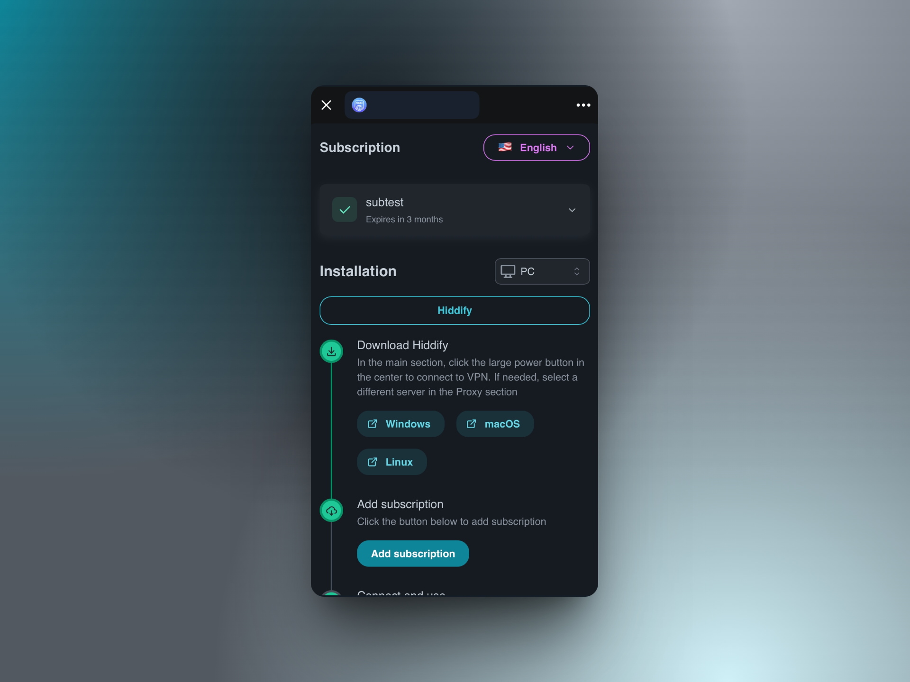

# Remnawave Telegram Subscription Mini App

## Description

This is the **Telegram Subscription App** for Remnawave (https://remna.st/). 
The page allows see their subscriptions directly through Telegram. As a requirement for using the page, the **Telegram ID** must be set in the user's profile to ensure proper identification and linking of subscriptions.




## Features

- View your subscriptions in the mini app
- Multi-language support (English, Russian)

## Environment Variables

The application requires the following environment variables to be set:

| Variable          | Description                                                                                                   |
|-------------------|---------------------------------------------------------------------------------------------------------------|
| `REMNAWAVE_URL`   | Remnawave API PLAIN DOMAIN(panel.domain.com)                                                                  |
| `REMNAWAVE_MODE`  | Remnawave mode (remote/local), default is remote. If local set – you can pass remnawave:3000 to REMNAWAVE_URL |
| `REMNAWAVE_TOKEN` | Authentication token for Remnawave API                                                                        |
| `BUY_LINK`        | The URL for purchase actions                                                                                  |
| `CRYPTO_LINK`     | Allows using encrypted links (currently supported Happ application)                                           |
| `REDIRECT_LINK`     | Allows you to specify a **custom redirect page URL** for deep links. Useful for handling protocols like `v2box://` in Telegram Desktop (Windows). For more details and examples, see [Telegram Deep Link Redirect](https://github.com/maposia/redirect-page/tree/main)                                         |


## Plugins and Dependencies

### Remnawave

- [Remnawave-Subscription-Page](https://remna.st/subscription-templating/installation)

### Telegram Bot

- [Telegram Bot API](https://core.telegram.org/bots/api)
- [Telegram Mini App SDK](https://github.com/telegram-mini-apps)

## Setup Instructions

1. Create new directory for mini app

   ```bash
   mkdir /opt/remnawave-telegram-sub-mini-app && cd /opt/remnawave-telegram-sub-mini-app
   ```

2. Download and configure the environment variables.

   ```bash
   curl -o .env https://raw.githubusercontent.com/maposia/remnawave-telegram-mini-bot/refs/heads/main/.env.example
      ```

3. Configure the environment variables.
   ```bash
   nano .env
      ```
   
4. Create docker-compose.yml file

   ```bash
   nano docker-compose.yml
      ```
Example below.

```yaml
services:
   remnawave-mini-app:
      image: ghcr.io/maposia/remnawave-telegram-sub-mini-app:latest
      container_name: remnawave-telegram-mini-app
      hostname: remnawave-telegram-mini-app
      env_file:
         - .env
      restart: always
      # volumes:
      #   - ./app-config.json:/app/public/assets/app-config.json
      ports:
         - '127.0.0.1:3020:3020'
#      networks:
#         - remnawave-network

#networks:
#   remnawave-network:
#     name: remnawave-network
#      driver: bridge
#      external: true
```

Uncomment if you want to use your own template downloaded from the Remna panel.
p.s. file must be placed in the same directory with this docker-compose file

```yaml
      volumes:
        - ./app-config.json:/app/public/assets/app-config.json
```

Uncomment if you want to use local connection via single network in docker

```yaml
     networks:
        - remnawave-network

networks:
   remnawave-network:
     name: remnawave-network
      driver: bridge
      external: true
```

5. Run containers.
   ```bash
   docker compose up -d && docker compose logs -f
   ```
6. Mini app is now running on http://127.0.0.1:3020

Now we are ready to move on the Reverse Proxy installation.

## Update Instructions

1. Pull the latest Docker image:

   ```bash
   docker compose pull
   ```

2. Restart the containers:
   ```bash
   docker compose down && docker compose up -d
   ```
